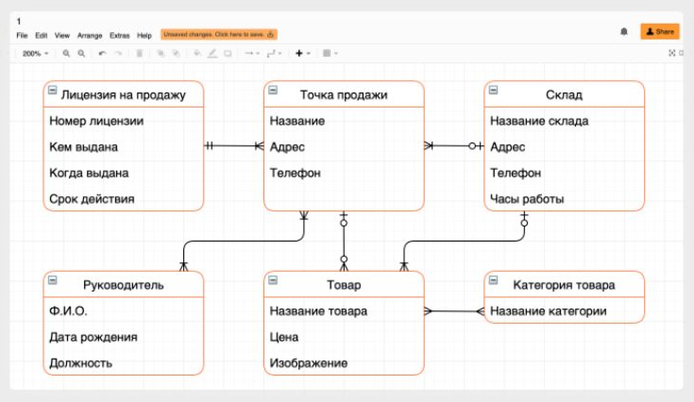

# Разработан ли чек-лист проектировщика?

Проверить, что: 
- Все [действия клиента или системы](https://bureau.ru/soviet/20200211/) задокументированы в формате Use Case.
- Описаны все краевые сценарии (ожидаемое поведение системы для всех предполагаемых ошибочных условий).
- Требования не выходят за рамки проекта.
- Каждое требование описано точно, понятно и недвусмысленно.
- Каждое требование можно проверить с помощью тестирования, придумать решение на сложные случаи.
- Отрисованы все состояния страниц:
  - состояние «без данных»,
  - во время загрузки,
  - ошибка при загрузке,
  - успех.
- Продуманы состояния контролов:
  - Тип поля
  - Обязательно ли для заполнения
  - Есть ли требования к вводимым данным
  - Минимальные и максимальные значения
  - Значение по умолчанию
  - Наличие или отсутствие плейсхолдера
  - Enabled, Disabled, Hover, Focus, Active, Pressed
  - Кликабельные области элементов, если они больше видимых
  - Работа с помощью клавиатуры
  - Маски
  - Валидация и сообщения об ошибках
- Для всех анимаций подготовлены отдельные прототипы и описания.
- Знаем как тянется дизайн и выглядит на мобильных устройствах.
- Продумано адаптирование сайта для пользователей с ограниченными возможностями.
- Продуман переход к предыдущему экрану.
- Нужны ли подсказки для режима новичков.
- Задача прошла юзабилити-тестирование.
- Подготовлен список потенциальных вопросов от пользователей и ответы на них.
- Продуман процесс сбора фидбэка
- Составлена ERD-диаграмма: как разные сущности (люди, объекты, концепции) связаны между собой внутри системы.

- [Составлена диаграмма последовательности](https://creately.com/blog/ru/%D0%B4%D0%B8%D0%B0%D0%B3%D1%80%D0%B0%D0%BC%D0%BC%D0%B0/%D1%83%D1%87%D0%B5%D0%B1%D0%BD%D0%BE%D0%B5-%D0%BF%D0%BE%D1%81%D0%BE%D0%B1%D0%B8%D0%B5-%D0%BF%D0%BE-%D0%BF%D0%BE%D1%81%D0%BB%D0%B5%D0%B4%D0%BE%D0%B2%D0%B0%D1%82%D0%B5%D0%BB%D1%8C%D0%BD%D0%BE%D0%B9/). С помощью нее можно смоделировать взаимодействие между объектами и сценариями использования и понять:
  - как объекты обмениваю тся сообщениями (в том числе со сторонними системами),
  - какие ограничения накладываются на взаимодействие объектов,
  - какие события инициируют взаимодействие объектов.

## Согласования
### Заказчики
Чаще всего заказчиками выступают продакты, но в редких случая задача может прийти от генерального директора. Согласование с заказчиками не регламентировано, но обязательно.

### Аналитик
Необходимо составить и согласовать с аналитиком список метрик, которые помогут посчитать пользу от задачи и понять, как пользователи пользуются новым функционалом.

Прописать логику формирования тикетов:
>Когда цена поездки была не фиксированной, а предполагаемой, то в момент ее существенного превышения, в службу поддержки формировался автоматический тикет (обсудить с ТП состав тикета). 
>
>А отдел маркетинга придумал опцию автоматического возврата излишне списанных средств. Такой пользователь становился супер-лояльным.
>
>*Пример из Яндекс.Такси*

### Три амиго
Это практика, которая помогает:
- Прийти к общему соглашению относительно ожиданий до начала разработки.
- Сформировать соглашение о том, как сделать правильную вещь сразу.

Участники встречи:
- Другой проектировщик
- Бэкенд, если по задаче требуется бэк
- Фронтенд, если по задаче требуется фронт
- Тестировщик

### Юрист
Некоторые задачи следует обязательно согласовывать с юристом. Особенно это касается новых формулировок, которые возникают в интерфейсах между компанией и клиентами.

### SEO
Если мы запускаем новую внешнюю индексируемую страницу или сильно переделываем старую, следует инициировать ее согласование с сеошниками.

### Редактор или UX-писатель
Показываем интерфейсные тексты. Получаем чек.

### Маркетинг и PR
  - Знаем как рассказать о фиче: Release Notes, рассылка, онбординг.
  - Информационные материалы готовы или готовятся.
  - Согласована настройка целей в Метрике.
  - Сроки запуска согласованы и зафиксированы.

### Саппорт
Знают о запуске. Готовим для них инструкции по работе с новым функционалом и ответы на потенциальные вопросы пользователей.

## Ссылки
[Проектировщик интерфейсов в Контуре](https://guides.kontur.ru/principles/uidesigner/)

[Эталонные сервисные модели и паттерны](https://hardclient.com)