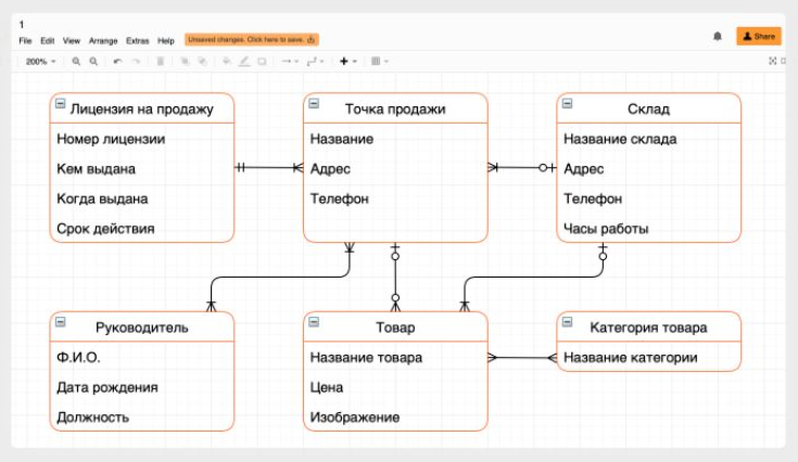
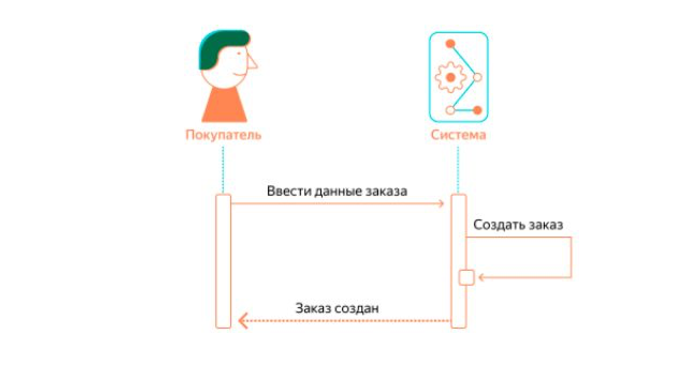

# Разработан ли чек-лист проектировщика?

Проверить, включены ли в требования все необходимые [действия клиента или системы](https://bureau.ru/soviet/20200211/) для достижения цели. И задокументированы в формате [Use Case](/po/researches/scriptAudit.md).

Проверить, описано ли в требованиях ожидаемое поведение системы для всех предполагаемых ошибочных условий, то есть краевые сценарии?

Убедиться, что требования не выходят за рамки проекта.

Убедиться, что каждое требование описано точно, понятно и недвусмысленно.

Проверить, можно ли каждое требование проверить с помощью тестирования, придумать решение на такой случай.

Составлена ERD-диаграмма: как разные сущности (люди, объекты, концепции) связаны между собой внутри системы.

[Составлена диаграмма последовательности](https://creately.com/blog/ru/%D0%B4%D0%B8%D0%B0%D0%B3%D1%80%D0%B0%D0%BC%D0%BC%D0%B0/%D1%83%D1%87%D0%B5%D0%B1%D0%BD%D0%BE%D0%B5-%D0%BF%D0%BE%D1%81%D0%BE%D0%B1%D0%B8%D0%B5-%D0%BF%D0%BE-%D0%BF%D0%BE%D1%81%D0%BB%D0%B5%D0%B4%D0%BE%D0%B2%D0%B0%D1%82%D0%B5%D0%BB%D1%8C%D0%BD%D0%BE%D0%B9/). С помощью нее можно смоделировать взаимодействие между объектами и сценариями использования.

- как объекты обмениваются сообщениями (в том числе со сторонними системами),
- какие ограничения накладываются на взаимодействие объектов,
- какие события инициируют взаимодействие объектов.

Убедиться, что отрисованы все состояния страниц:
- состояние «без данных»,
- во время загрузки,
- ошибка при загрузке,
- успех.

Продуманы состояния контролов:
- Enabled, Disabled, Hover, Focus, Active, Pressed,
- кликабельные области элементов, если они больше видимых,
- работа с помощью клавиатуры,
- маски,
- валидация и сообщения об ошибках.

Продумано адаптирование сайта для пользователей с ограниченными возможностями.

Продуман переход к предыдущему экрану.

Для всех анимаций подготовлены отдельные прототипы и описания.

Знаем как тянется дизайн и выглядит на мобилках.

Нужны ли подсказки для режима новичков.

Задача прошла юзабилити-тестирование.

Подготовлен список потенциальных вопросов от пользователей и ответы на них.

Моб. Состояние, если запретил использование геопозиии.

Моб. Состояние, если пропал интернет.

## Согласования

- Заказчики
- Другие проектировщики
- Смежники определены и готовы поддержать
- Аналитик. [Составляет таблицу событий](../develop/logs.md)
- Юрист
- Редактор или UX-писатель
- Маркетинг и PR.
  - Знаем как рассказать о фиче: Release Notes, рассылка, онбординг.
  - Информационные материалы готовы или готовятся.
  - Согласована настройка целей в Метрике.
  - Сроки запуска согласованы и зафиксированы.
- SEO
- Саппорт
- Разработка
  - Идем к тим-лиду за оценкой и определением исполнителя.
  - Идем к исполнителю, согласовываем оценку и [погружаем в задачу](https://bureau.ru/soviet/20131125/).
  - Декомпозируем задачу.
- Переводчики
- DevOps или системные администраторы. Знают о задаче и потребностях. Предложили архитектуру, готовы держать нагрузку. Прописаны требования в задаче.
- Тестировщики
  - Противоречий не нашли.
  - Детализация устраивает.
  - Готовят тест-кейсы и тест-план.

## Документация

Прописана логика формирования тикетов:
>Когда цена поездки была не фиксированной, а предполагаемой, то в момент ее существенного превышения, в службу поддержки формировался автоматический тикет (обсудить с ТП состав тикета). 
>
>А отдел маркетинга придумал опцию автоматического возврата излишне списанных средств.Такой пользователь становился супер-лояльным.
>
>*Пример из Яндекс.Такси*

Подготовлены картинки для Release Notes.

Подготовлены картинки для раздела «Помощь».

Актуализирована библиотека компонентов.

## Ссылки

[Проектировщик интерфейсов в Контуре](https://guides.kontur.ru/principles/uidesigner/)