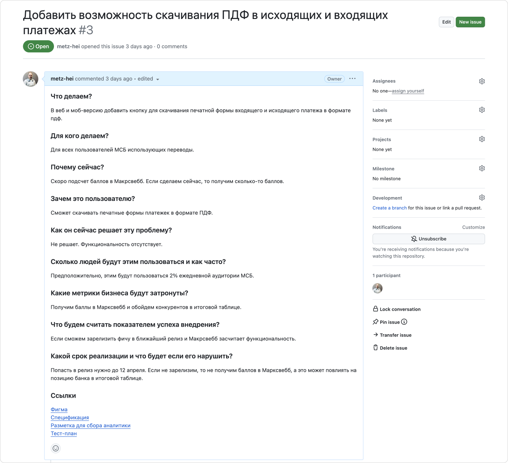
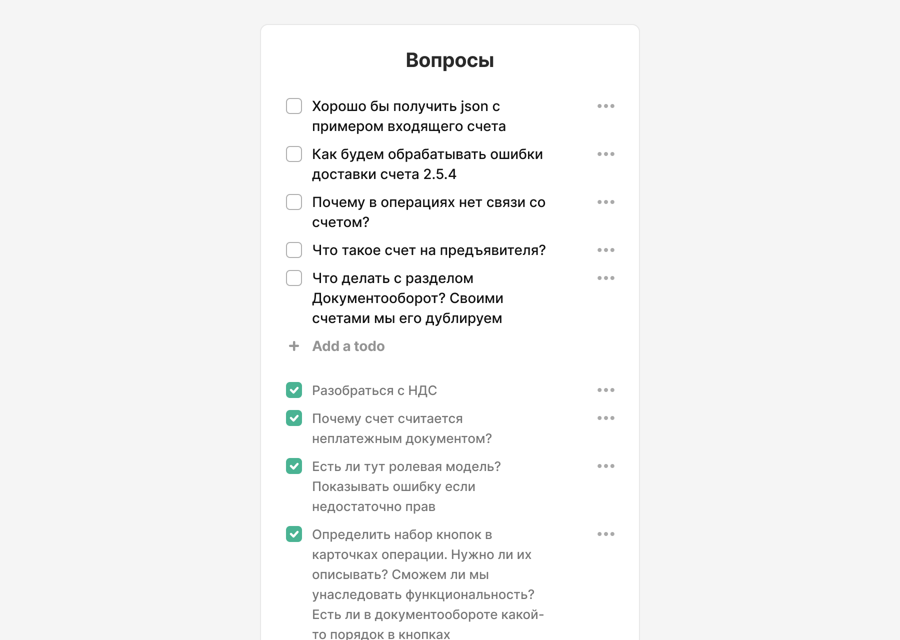
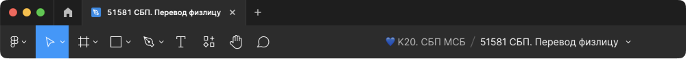
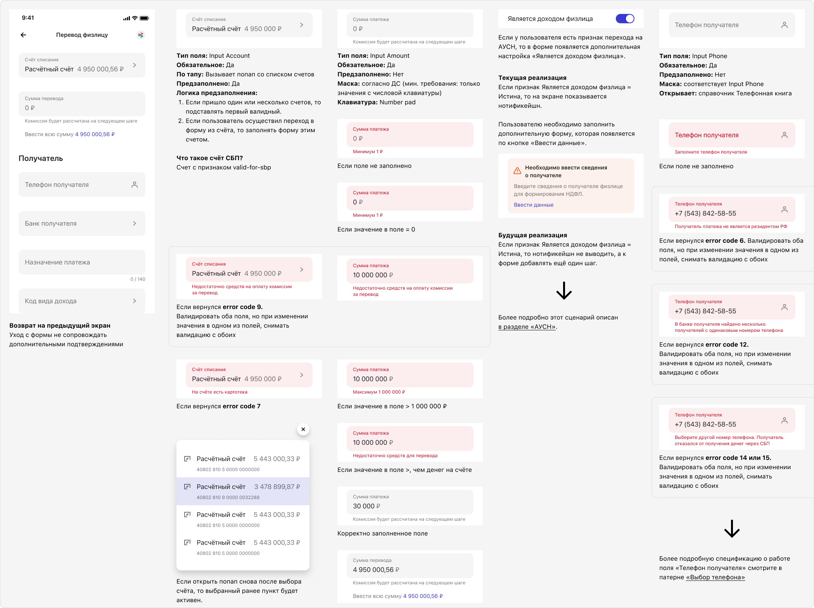
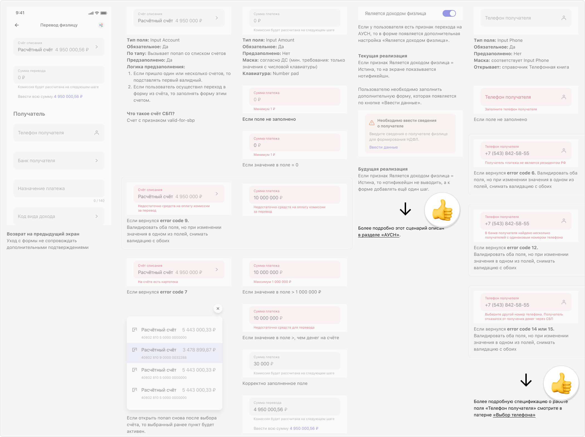

# Как оформляете макеты?

## Почему это важно?
Макеты это главный артефакт дизайнера в продуктовой разработке. В процессе движения макетов по релизному циклу с ними взаимодействуют другие дизайнеры, менеджеры, аналитики, разработчики и QA-инженеры.

Макеты должны быть понятными и одинаковыми с точки зрения структуры и описания. Это сэкономит время на погружение в задачу, а значит сократит Time to Market и позитивно повлияет на общую удовлетворенность команды качеством задач, уходящих в разработку. 

Требования к ясности и единообразию макетов приобретают большее значение, когда есть несколько команд разработки и дизайнеров. Макеты должны быть унифицированы:
1. Чтобы при замене или переходе дизайнера другую команду, принимающей команде не пришлось заново переучиваться работе с макетами.
2. Другим дизайнерам было легко ориентироваться в макетах друг-друга.

## Как это может быть устроено
### Расскажите о задаче
Это базовый фрейм с описанием задачи, он нужен для того, чтобы все участники продуктовой команды и стейкхолдеры одинаково понимали какую задачу вы решаете. Также в макеты часто приходят коллеги, незнакомые с продуктом, чтобы посмотреть некоторые решения. Этот фрейм поможет им погрузиться в задачу.

Фрейм может отвечать на базовые вопросы вашего DoR, например:
- Что делаем?
- Для кого делаем?
- Почему сейчас?
- Зачем это пользователю?
- Как он сейчас решает эту проблему?
- Сколько людей будут этим пользоваться и как часто?
- Какие метрики бизнеса будут затронуты?
- Что будем считать показателем успеха внедрения?
- Какой срок реализации и что будет если его нарушить?

Здесь же можно разместить мета-информацию: дату, статус и исполнителей.

Но это неправильный подход, не делайте так. Лучше всего в качестве единого источника правды выбрать таск-трекинговую систему, где задача аккумулирует все необходимые данные: DoR, ссылки на макеты, исследования, документацию, аналитическую разметку, тест-план и прочее.

В этом случае не нужно выносить описание задачи в Фигму, так вы создадите еще один источник правды, за которым придется следить и обновлять его.

Но если в команде нет культуры работы с таск-трекером, то рассказывайте о задаче хотя бы в Фигме.

### Вопросы
Проектируя интерфейс неизбежно возникнет миллиард вопросов. Чтобы не отвлекать членов команды по каждому вопросу, но и в то же время не забыть — запишите их. Для этого идеально подойдет встроенный виджет Scope Todo. На очередной встрече можете снять все вопросы разом.

### Название файла
Если все построено на базе баг-трекера, то файл в Фигме должен называться так же как и задача в трекере, включая номер задачи, так вы без труда найдете файл зная только номер задачи в трекере.

Такой подход приведет вас к декомпозиции, вместо одного файла, где хранятся все сценарии проекта, у вас будет маленькая часть на конкретные изменения.

### Описание интерфейса
Главная задача макетов описать не то как интерфейс выглядит, а как он работает. Хранить описания можно рядом с экранами. Но это плохая практика, лучше делать это в специальном документе — спецификации. Обычно за написание этого документа отвечает системный или бизнес-аналитик. Дизайнер может скооперироваться с ним и дописать свою часть.

Если в команде нет культуры коллективной работы над спецификацией, то описывайте интерфейс в Фигме.

### Добавляйте связи
Если сценарий получился крупным, то делать его в рамках одной задачи будет сложно и неправильно. Декомпозируйте ее. А чтобы сценарий остался цельным, добавьте в макет связь с остальными сценариями.

### Отделите компоненты
Если ваша дизайн-система позволяет создавать локальные компоненты без занесения в мастер-ветку, то для них лучше создать отдельную страницу.

### Архив
В процессе проектирования сценария неизбежно возникнут промежуточные варианты, бенчи и прочее, никогда не удаляйте эту информацию, если она стала неактуальной, просто перенесите ее на специальную страницу. Она вам еще пригодится.

### Не дублируйте экраны с разными состояниями
Если у вас есть экран на котором, в зависимости от каких-то условий, меняется какая-то часть экрана, то не дублируйте его, чтобы показать все состояния, а соберите все через локальные компоненты. См. [Мастер‑класс Ильи Бирмана «Умные компоненты в Фигме»](https://www.youtube.com/live/5tmNLdUfXcY).

### Общие принципы оформления и гигиены
- Удаляйте скрытые слои.
- Используйте на максимум нативные функции Фигмы: Constraints, Auto Layout
- Добавляйте осмысленные названия к экранам и нумеруйте их согласно порядку во флоу (1.1, 1.2, 2.1.1, 2.1.2).
- Проверяйте файл линтерами.
- Убедитесь, что вы подтянули актуальную ветку дизайн-системы.
- Закройте все комментарии перед отправкой в разработку.
- Для демонстрации переходов между экранами используйте плагин Autoflow.
- Каждый смысловой блок или флоу группируйте в секцию.
- Установите набор типичных отступов:
  - Внутри секции — 48px;
  - Между экранами по горизонтали и вертикали: для мобильных — 56px, для десктопных — 80px;
  - Флоу размещаются друг под другом с отступом 280px;

