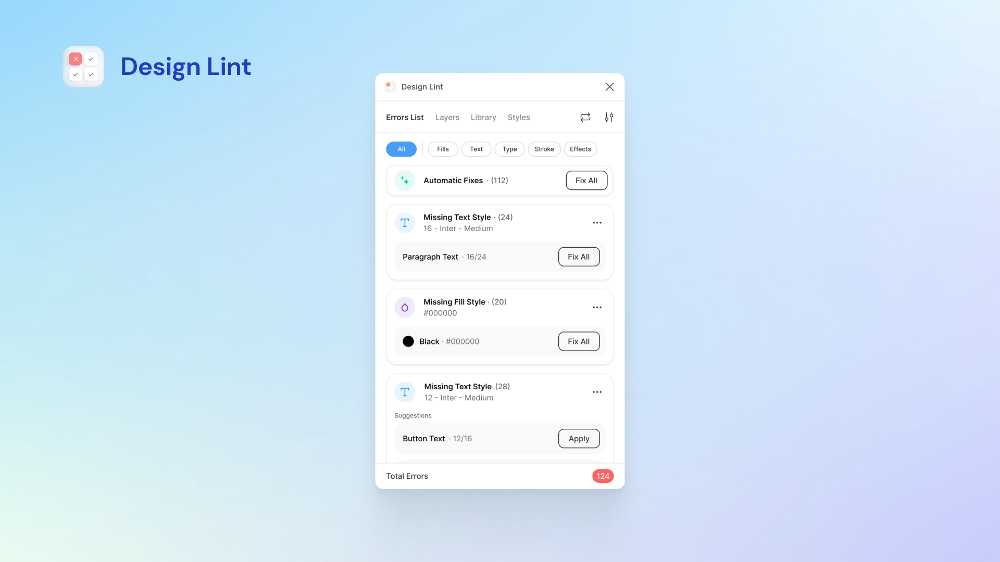

# Есть ли у вас линтеры?

## Почему это важно?
Линтер — это программа, которая автоматизирует всю рутину и сама «причёсывает» макет по определённым правилам.

## Как это может быть устроено?
Например, у вас к компании есть Tone of Voice или редполитика, которая устанавливает определенные правила при работе с текстом. Но установить правила это половина дела, другая половина — научиться их соблюдать. А это самое сложное.

Для таких вещей придумали линтеры, подключить их можно к чему угодно: к документации, Фигме или даже формам на сайте и в приложении.

### Проверка орфографии
Самый базовый линтер. Можно написать на основе API Яндекс Спеллера.

### Проверка на соответствие редполитике
Подойдет [Vale](https://github.com/errata-ai/vale). Это готовый линтер, вам останется только научить его правилам вашей редполитики.

Например:
- Вы различаете символы минуса, дефиса и тире.
- Вместо выражения «денежные средства» вы пишите «деньги».
- Вы не пишете копейки, если их нет.
- Если копейки есть, то вы отделяете их запятой.
- Вы различаете кавычки «ёлочки» и «лапки».
- Вы разделяете числа на разряды начиная с тысяч.
- «Вы» и «Вас» вы пишите с маленькой буквы.

  <video width="100%" height="100%" playsinline muted controls>
    <source src={require('./vale.mp4').default} type="video/mp4" />
  </video>

### Проверка на соответствие правилам дизайн-системы
Для этого подходит плагин для Фигмы — [Design Lint](https://www.figma.com/community/plugin/801195587640428208/design-lint). Он проверяет стили текста, заливки, обводки, радиуса или эффектов в ваших макеты на соответствие дизайн-системе. 

