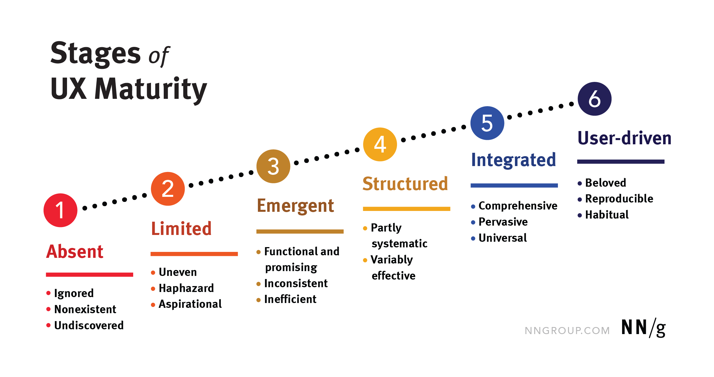

# Какие принципы дизайна приняты в компании?

Принципы дизайна являются важными составляющими хорошего дизайна, особенно, когда организация находится на [определенной стадии UX-зрелости](https://www.nngroup.com/articles/ux-maturity-model/).

