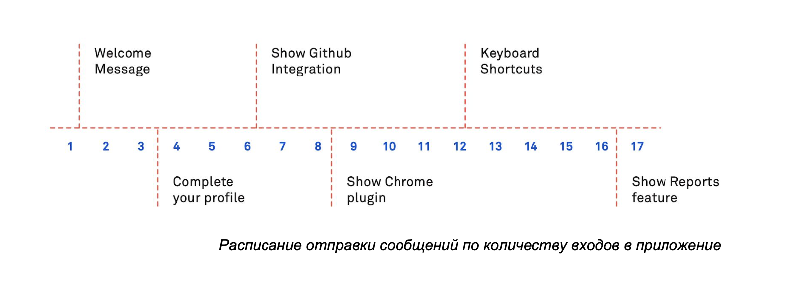

# Как рассказать о фиче

Сообщения по почте неудачный вариант для таких анонсов, потому что они часто приходят в неподходящее время и в неверном контексте. 

Подходящее время для анонса улучшений, это когда пользователь находится в приложении, и готов использовать улучшение. Для этого идеально подходят анонсы внутри приложения, которые срабатывают по определенным правилам и событиям.

Мы рекомендуем нашим клиентам создавать расписание по отправке сообщений, чтобы постепенно показывать некоторые функции. Когда вы хорошо понимаете ваших пользователей, вы сможете решить какие второстепенные функции радуют и в какой момент они полезны.

После выделения таких функций, это вопрос своевременных сообщений. Интерком позволяет регулировать отправку в течение серии сессий. В результате, каждый раз, когда пользователь входит в приложение, вы показываете ему все больше и больше поводов остаться с вами.

Всегда, в каждом сообщении пишите, что вы готовы помочь если есть вопросы. Это ключ к получению обратной связи, который помогает улучшать процедуру вовлечения.

Вы можете разделить клиентов на две группы: кто заходил в приложение с телефона и кто нет. Это позволит создать подходящее сообщение для каждой группы.

Вы можете создать постоянное сообщение в веб-приложении для тех кто заходит с мобильного телефона, чтобы они знали о мобильное приложении. Вы можете отправить email всем кто вышел из приложения, потому что они еще помнят о вашем приложении.