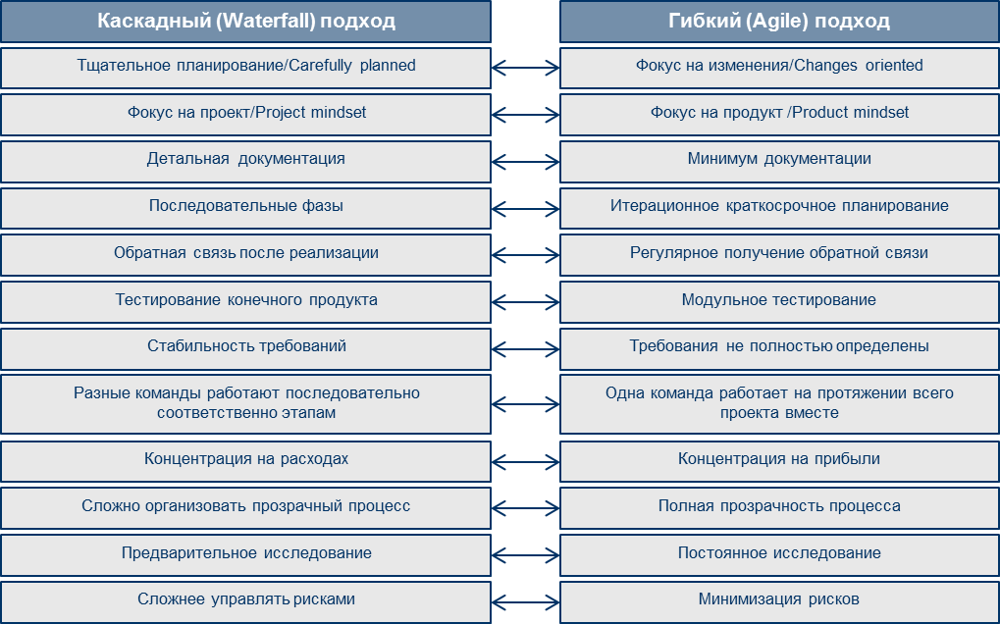

# Agile и Waterfall

## Манифест

Люди и взаимодействие важнее процессов и инструментов

Работающий продукт важнее исчерпывающей документации

Сотрудничество с заказчиком важнее согласования условий контракта

Готовность к изменениям важнее следования первоначальному плану 

То есть, не отрицая важности того, что справа, мы всё-таки больше ценим то, что слева.

## Принципы Agile-манифеста

Наивысшим приоритетом для нас является удовлетворение потребностей заказчика, благодаря регулярной и ранней поставке ценного программного обеспечения.

Изменение требований приветствуется, даже на поздних стадиях разработки. Agile-процессы позволяют использовать изменения для обеспечения заказчику конкурентного преимущества.

Работающий продукт следует выпускать как можно чаще, с периодичностью от пары недель до пары месяцев.

На протяжении всего проекта разработчики и представители бизнеса должны ежедневно работать вместе.

Над проектом должны работать мотивированные профессионалы. Чтобы работа была сделана, создайте условия, обеспечьте поддержку и полностью доверьтесь им.

Непосредственное общение является наиболее практичным и эффективным способом обмена информацией как с самой командой, так и внутри команды.

Работающий продукт — основной показатель прогресса.

Инвесторы, разработчики и пользователи должны иметь возможность поддерживать постоянный ритм бесконечно. Agile помогает наладить такой устойчивый процесс разработки.

Постоянное внимание к техническому совершенству и качеству 
проектирования повышает гибкость проекта.

Простота — искусство минимизации лишней работы — крайне необходима.

Самые лучшие требования, архитектурные и технические решения рождаются у самоорганизующихся команд.

Команда должна систематически анализировать возможные способы улучшения эффективности и соответственно корректировать стиль своей работы.

## Scrum
[Scrum-события](scrum-events.md)

[Scrum-артефакты](attachments/Scrum-события.pdf)

## Сравнение Agile и Waterfall

