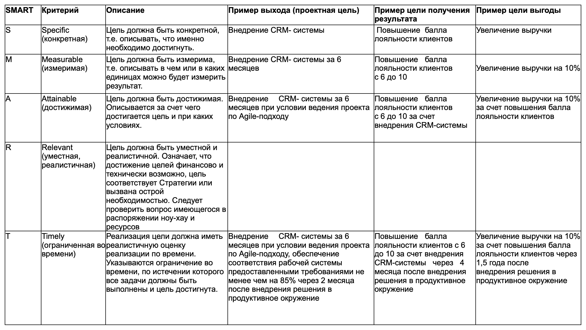

# HADI

[Цикл HADI](https://bureau.ru/soviet/20190425/): Гипотеза → Действие → Данные → Выводы

Для упрощения составления гипотез в рамках HADI-цикла используют принцип SMART:

Specific (Конкретная). Гипотеза должна быть конкретной. Она должна четко описывать, что изменяем и к чему стремимся.

Measurable (Измеримая). Метрика для измерения результата: объем продаж, количество звонков и т.п.

Attainable (Достижимая). Поставленная цель должна быть достижимой. Обновить контент на 100 страницах до конца завтрашнего дня — недостижимая цель. На это просто не хватит времени.

Relevant (Уместная). Выбранная гипотеза должна относиться к компании и вести к цели проекта.

Time-bound (ограниченная по времени). Ограничение по времени. На проверку гипотезы должно отводиться минимум времени, чтобы протестировать наибольшее количество вариантов. Как правило, длительность одного цикла — 1-2 недели.

Гипотеза может быть любой. Главное условие — возможность объективной оценки по количественному признаку. И не нужно бояться, что она окажется неудачной. Задача HADI-циклов — не только определять успешные гипотезы, но и неудачные, чтобы не тратить на них время и деньги.

Еще одно описание смарта из Фольксваген банка:
