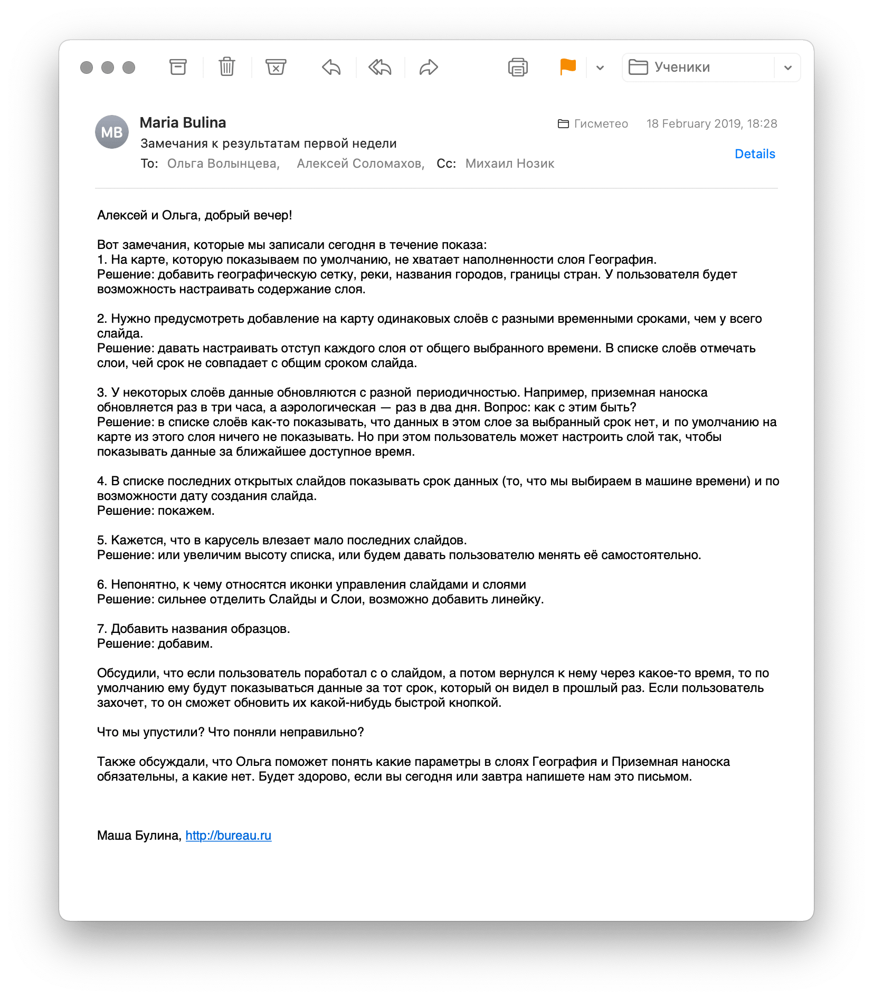

# Всегда готовим протокол встречи и фиксируем договоренности

Договоренности надо фиксировать, иначе, считайте, их нет. Большая часть этого списка про договоренности. Например, есть страница Code guidelines — значит все пишут более-менее одинаковый код. Или Environment — команда знает какие серваки существуют и для чего используются.

**General**
- Team, roles, responsibilities
- Retrospectives
- Risks
- Sprint reports
- Release notes
- Non-functional requirements
- UX personas
- DOD
- DOR
- JIRA flow
- Personal meetings

**Dev**
- Architecture & Technologies
- Environments
- Code guidelines
- Build versions
- Gitflow
- Deployment guide
- Builds (Jenkins)

**QA**
- Credentials
- Performance tests results
- Integration tests
- Test plan
- Reports