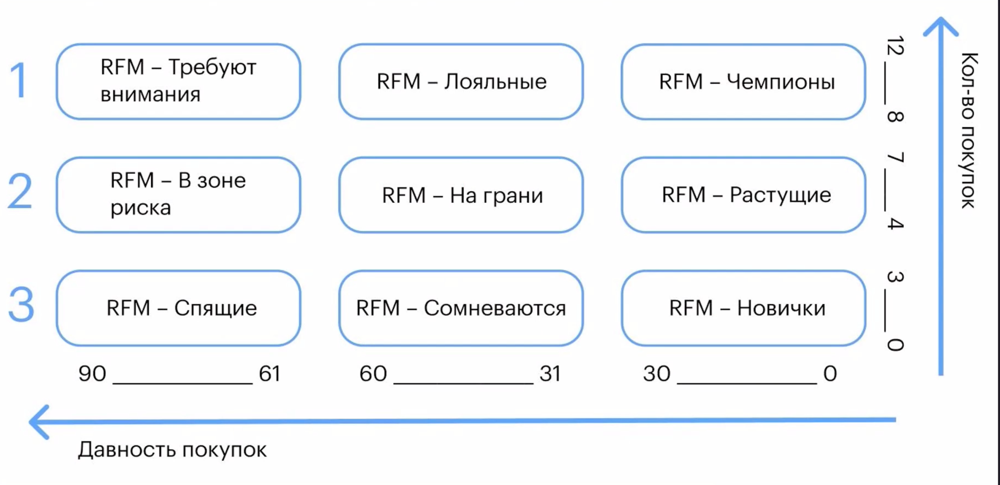
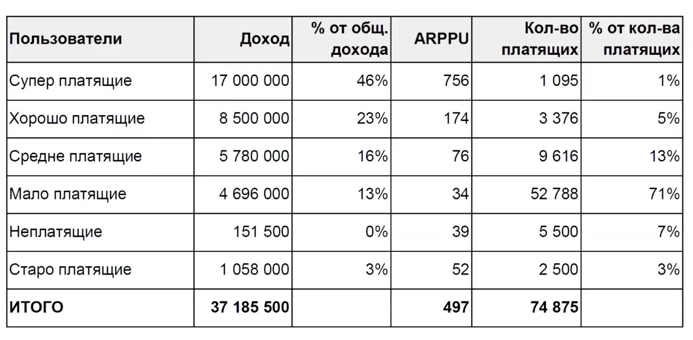
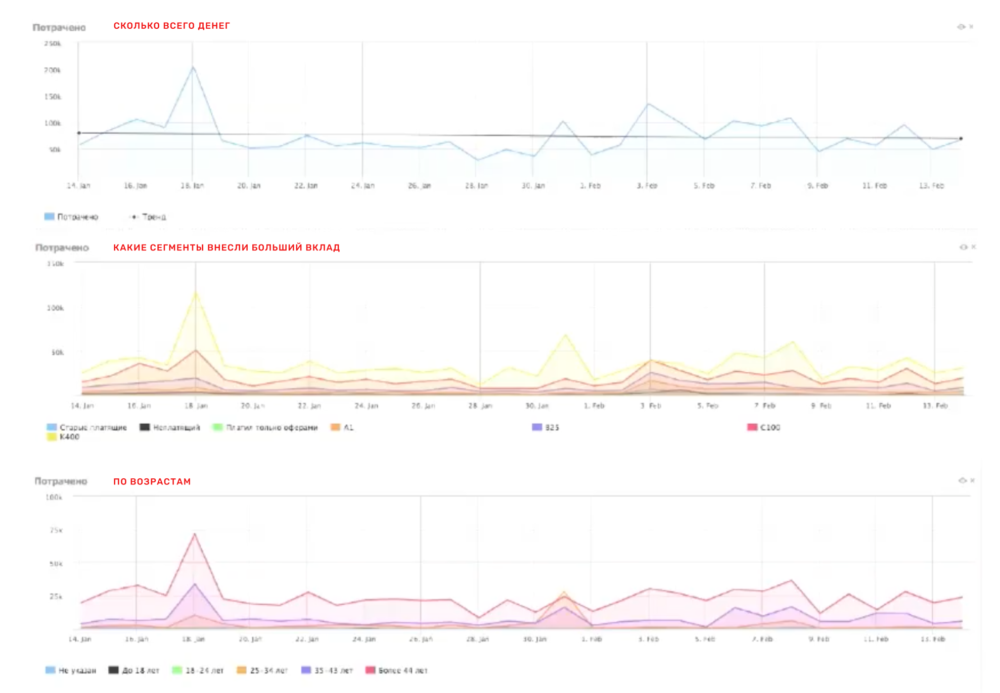

# RFM-анализ

Метод анализа, позволяющий сегментировать клиентов по частоте и сумме покупок и выявлять тех клиентов, которые приносят больше денег.

**Критерии сегментирования**

- Средний чек
- Частота покупки
- Сумма покупок
- Количество позиций в чеке
- Когда последний раз покупали

**Что делать для платящих**

- Сделать отдельную «горячую линию» поддержки «китов»
- Добавить в white-list по процессингу: это когда пользователь закидывает максимально возможный разовый платеж, а через короткое время снова пытается это сделать, и процессинг его банит
- Повысить приоритет всех тикетов
- Различные скидочные условия (для малоплатящих один ARPPU, для суперплатящих другой ARPPU). Не надо запускать одинаковые акции для всех: кто-то еле-еле потянет 1000 ₽, а для кого-то это копейки и не вообще не тот объем.
- Подумать как выходить на окружение супер платящих пользователей, скорее всего у них тоже есть деньги. Через рекомендации...

**Настроить триггеры**

- Мониторить смену пользователем категорию платежеспособности, или он вообще перестал платить. В зависимости от категории звоним ему или отправляем письмо
- нет ли у платящих пользователей циклов, напр пополняет когда пришла ЗП, в этот день присылать письмо с акцией
- Если у супер платящего в момент оплаты падает ошибка или что-то еще, то сразу выводить его на техподдержку

**Для маркетинга**

Таргетировать объявления по похожим сегментам.