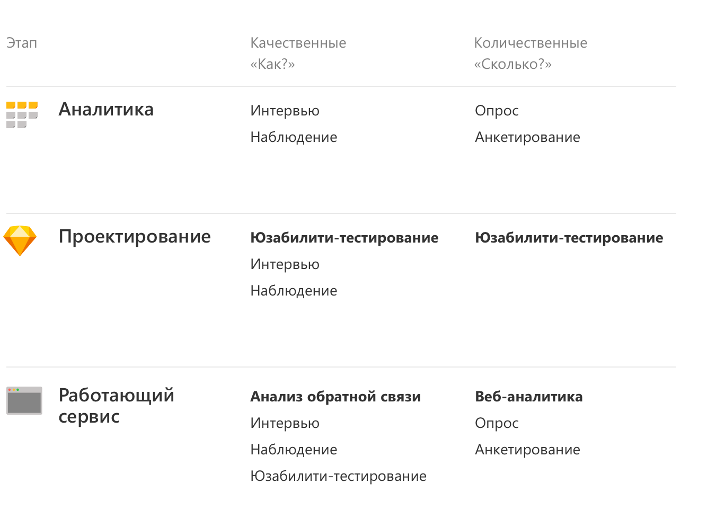

# Как ищутся гипотезы?

В этом документе описаны принципы и способы проведения пользовательских исследований. Все это поможет исследователям и командам разработки договариваться и создавать полезные сервисы для людей.

По мотивам [принципов пользовательских исследований в Контуре](https://guides.kontur.ru/principles/user-research/usabilityresearch/).

В дополнение к гайдам Контура можно проводить различные аудиты.

[Аудит привлечения](./marketing.md)

[Аудит функционала](./functionalityAudit.md)

[Технический аудит](./technicalAudit.md)

[RFM-анализ](./RFM.md)

[Анализ сценариев и CJM](./scriptAudit.md)

[Юзабилити-тестирование](./usability.md)

[UX-исследования](https://vc.ru/design/148299-21-metod-ux-issledovaniy-kakoy-vybrat)

[База проверенных гипотез](https://beztz.net)

## Подтверждение гипотезы с помощью А/Б
[A/B-тестирование через Метрику](https://yandex.ru/adv/solutions/cases/toyota-avtomir-ab-test)

[A/B-тестирование через Google Optimize](https://tilda.education/articles-yourfirstabtest#rec4326447)

## Результат исследований
Результат исследований может быть оформлен в виде следующих документов:

[Таблица конверсий](./conversionTable.md)

[Таблица с точечными улучшениями](../attachments/tablePointImprovements.jpg)

[Таблица с аналитикой постов](https://popsters.ru)