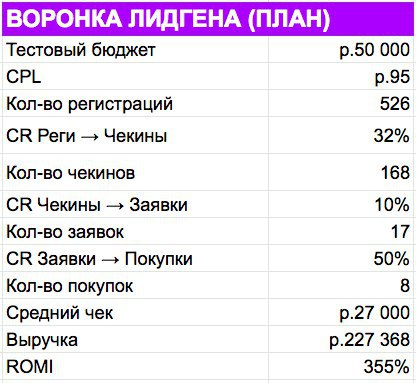

# Какие воронки у нас есть?

Узнайте как устроены ваши воронки: лэндинги, письма, соц. сети, пуши. 

> ## Как строить воронки?
> Автор примера [Давай запускай!](https://t.me/davay_zapuskay)
>1. Подробно обсудили, как устроена наша воронка. Лидгенщику важно понимать путь клиента и какие конверсии есть сейчас на каждом этапе: конверсия лэндинга, доходимость до вебинара, конверсия в заявки и оплаты.
>2. Я сам сел и описал профиль ЦА и составил карту месседжей — таблицу сегментов аудитории с набросками текстов заголовков и объявлений. Как правило, эту работу выполняет сам лидгенщик. Но я считаю, что качественно ее может сделать только человек с маркетинговыми мозгами, который глубоко в проекте. Поэтому делаю сам. Так вероятность успеха выше.
>3. Затем я написал инструкцию по UTM-разметке. Это важно, т.к. сквозная аналитика без правильных utm-меток работать не будет.
>4. Поставили цель для теста. На тест я выделил 50 тыс. руб. Задача лидгенщика уложиться в стоимость лида до 100 руб. Тогда мы получим 526 регистраций, которые при плановых конверсиях дадут 8 продаж на сумму 227 тыс. руб.
>5. Договорились, как будем оценивать результат. Оцениваю я всегда только одним способом — по ROMI (т.е. возврат на маркетинговые инвестиции). При этом хороший ROMI начинается от 300%.
>
>

## Автоворонка на примере Главреда
