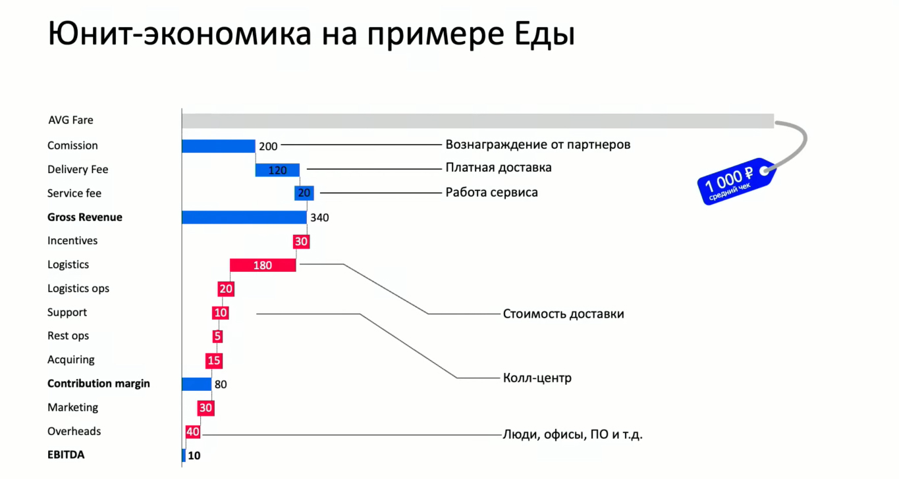

# Посчитана ли юнит-экономика?

Юнит-экономика — это метод экономического моделирования, используемый для определения прибыльности бизнес-модели путем оценки прибыльности юнита.

## Что такое юнит
- Заказ
- Пользователь
- Точка
  - Юнит-экономика самой точки
  - Юнит-экономика заказа
- Завод
- Единица продукции

## Как считать
- Оборот (GMV)
- Выручка
- Contribution margin/profit. Все доходы полученные по заказу - переменные расходы по заказу

## Юнит-экономика на примере Яндекс.Еды

### Incentives
- Маркетинговые промокоды и субсидии (рост активности и реактивация)
- Sorry-промокоды (компенсация пользователю за проблемы с заказом)
- Отмены (отмененные заказы по логистическим причинам)
- Возвраты (отмененные заказы по ресторанным причинам)
- Субсидии и скидки (скидка на доставку, когда образовался простой у курьеров и надо загрузить их работой)

### Logistics
- Такси
- Курьеры

### Logistics ops
- Найм курьеров
- Сумки для курьеров
- Аренда помещения для оформления курьеров

### Support
- Длительность обращения
- Стоимость ПО для саппорта
- Содержание рабочего места

### Rest ops
- POS-материалы для ресторанов
- Контент-отдел (все картинки и описания проходят через контент-отдел Яндекса)

## Зачем считать юнит-экономику
- Окупается ли маркетинг
- За сколько можно привлекать пользователя/открывать точку?
- Когда отобьются мои затраты?

## Ссылки
[Юнит-экономика — это просто](https://vc.ru/marketing/194030-yunit-ekonomika-eto-prosto)
