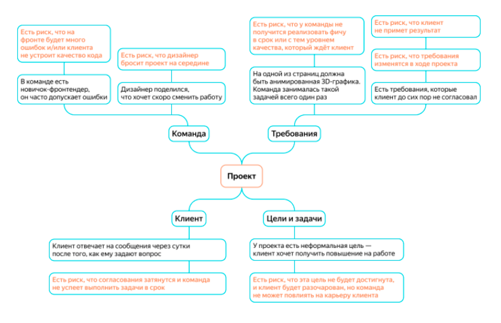
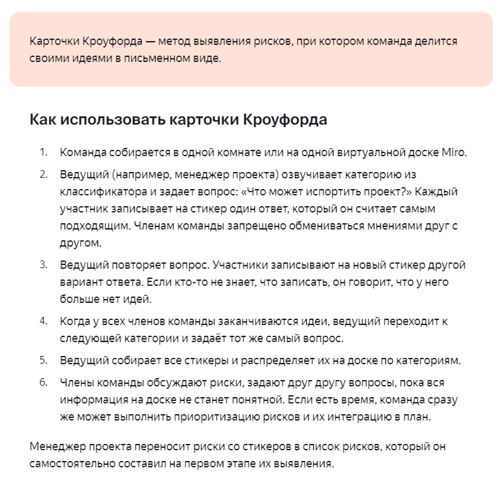

# Создается ли интеллект-карта рисков во время планирования эпика?

Выявление рисков — это творческий процесс. Никто не скажет менеджеру проекта, каким должен быть результат и сколько рисков нужно обнаружить.

Задача менеджера на этапе выявления рисков:
- собрать как можно больше информации о проекте,
- изучить похожие на него, но уже завершенные проекты,
- выявить неоднозначные факты и проблемные ситуации,
- предположить, к каким негативным последствиям они могут привести.

Обычно в IT-проектах главными источниками рисков является команда, требования, клиент, цели и задачи.

Необходимо подумать, какие слабые стороны есть у проекта. Для этого задайте себе вопросы о каждом источнике риска:

**Вопросы команде**
- Есть ли в команде неопытные участники? 
- Есть ли в команде проблемы с мотивацией?
- Все ли готовы работать на проекте N месяцев?

**Вопросы о требованиях**
- Есть ли в требованиях фичи, над которыми команда не работала ранее?
- Все ли требования понятны и не противоречат друг другу?
- Все ли требования согласованы с клиентом?

**Вопросы о клиенте**
- Как команда и клиент поймут, что проект завершен и завершен успешно?
- Понимает ли клиент, какой регламент разработки принят в команде? Посвящен ли он в инженерную культуру команды?

Ответьте на вопросы и отметьте на интеллект-карте беспокоящие факты, которые указывают на возможные проблемы. Такие факты называют условиями возникновения рисков.

Постройте причинно-следственные связи, предположите к каким последствиям могут привести имеющиеся условия возникновения рисков.

Проанализируйте другие источники возникновения рисков при помощи [классификатора рисков](./attachments/riskClassifier.xlsx).

На завершающем этапе, можно призвать на помощь команду и поискать новые риски с помощью Карточек Кроуфорда.

## Ссылки
Яндекс.Практикум. [Курс «Менеджер проектов»](https://practicum.yandex.ru/project-manager/)