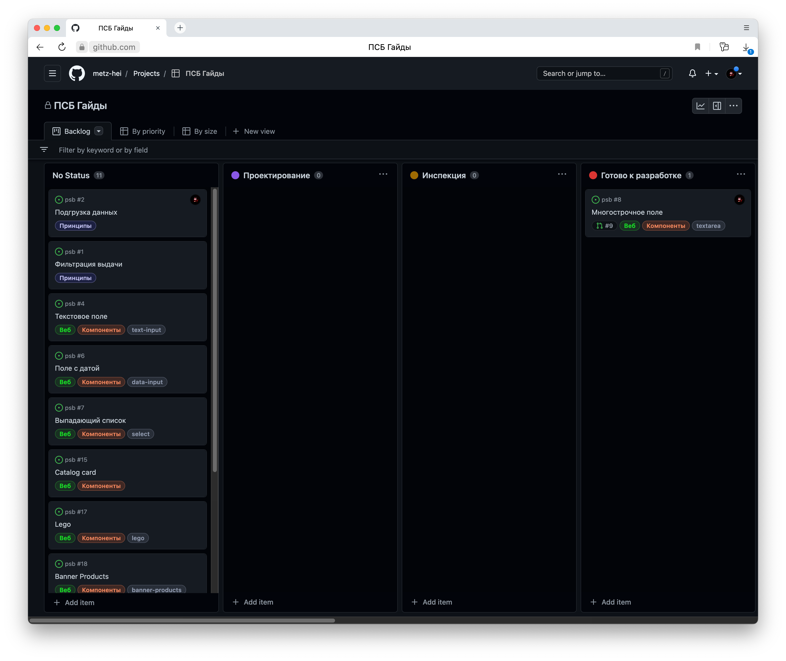
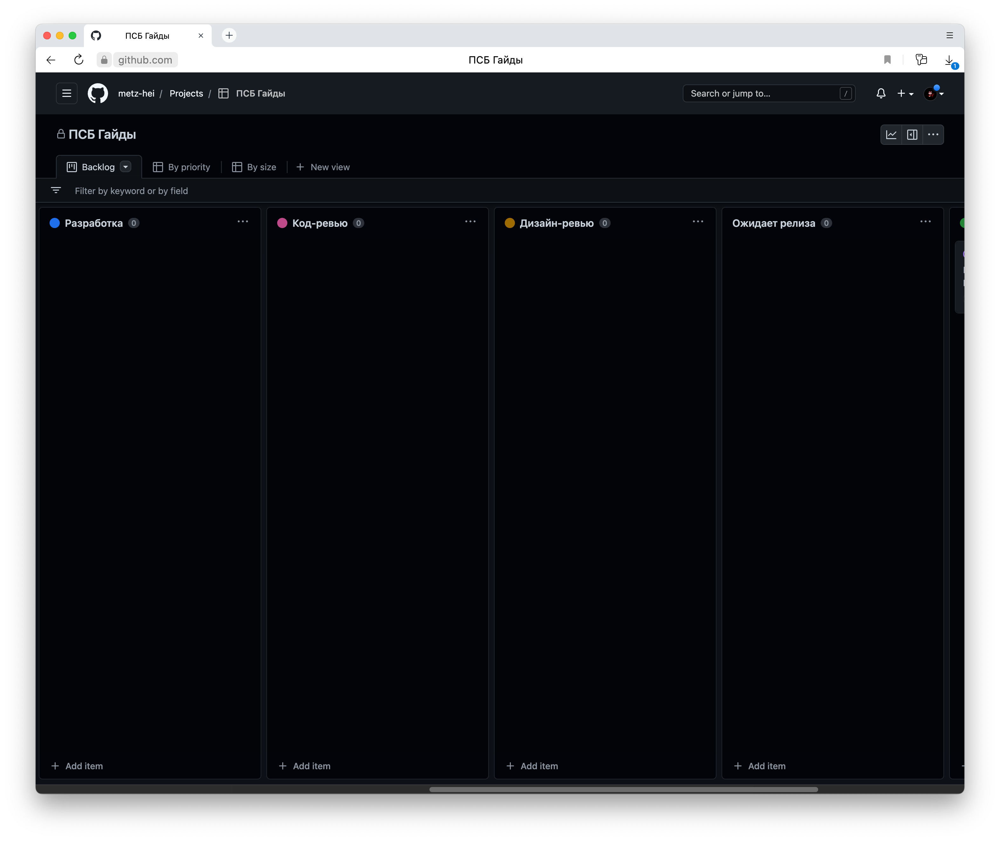
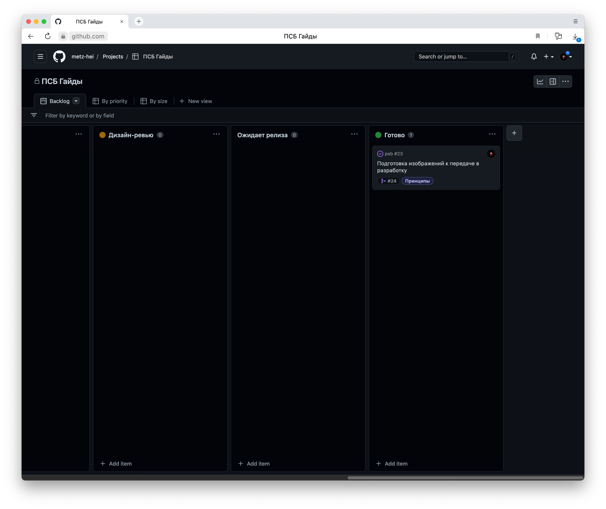

# Есть ли регламент движения задач?

## Почему это важно?
Четко выстроенный регламент привносит порядок и спокойствие в бэклог и спринты. Он формирует ответственность каждого члена команды за свой этап и за спринт в целом. Повышает скорость принятия решения и анализ текущей ситуации. 

Важно, чтобы регламент: 
1. Был задокументирован и поддерживался актуальным.
2. Был принят всеми членами команды.
3. Учитывал все особенности движения задач по каждому исполнителю.
4. Был прозрачным и учитывал все основные этапы разработки. 

## Как это может быть устроено?

Рассмотрим регламент движения задач команды дизайн-системы.

### Очередь или No Status
Список задач, которые на планировании были набраны из бэклога.

У задач допускается разная степень готовности к проектированию, это значит, что у задачи может не быть никакого описания и проектировщик должен будет определить пользу, сформулировать и спроектировать задачи, согласно принципам, принятым в команде

Смысл статуса в понимании текущих приоритетов команды. В этом статусе у задачи уже есть ответственный, он определяется на планировании, поэтому, когда дизайнер готов взять задачу в работу, он перетаскивает ее в колонку `Проектирование`. 

### Проектирование
Обязательный статус прохождения задачи.

Задача проектировщика — разобраться в задаче и подготовить ее к передаче в разработку. Во всём этом дизайнеру помогают принципы SMART, DoR и чек-лист проектировщика.

По готовности дизайнер двигает задачу в колонку `Инспекция`.

### Инспекция
К ответственным по задаче автоматически добавляются инспекторы дизайн-системы. 

Они должны проверить задачу, убедиться в её необходимости и готовности передачи в разработку. Критерии готовности сверяются по DoR.

Если инспекция пройдена, то один из инспекторов двигает задачу в статус `Готово к разработке`.

Если инспекция не пройдена, то задача возвращается на доработку. Причины возврата описываются в комментариях в макету или в комментариях к MR.

### Готово к разработке
Колонка-накопитель, здесь задачи ждут, когда разработчики смогут взять их в работу. Но прежде, тим-лид команды разработки оценивает задачи и проставляет ответственных. По готовности, ответственный разработчик берёт задачу в работу и двигает в статус `Разработка`.

### Разработка
1. Разработчик наделяется ответственностью, теперь судьба задачи в его руках. Он любит и лелеет ее. Вникает в смысл, думает о будущем, задает вопросы или приносит ответы.
2. Реализует задачу руководствуясь принципами инженерной культуры.
3. Комментирует все трудности и решения принятые по ходу реализации задачи.
4. Следит за колонкой и старается не набирать в нее много задач.
5. Следит за назначаемыми на него задачами, если пришел дефект по задаче, которая находится в тестировании, то его приоритет выше, чем у задач из бэклога. Важно, чтобы задача в тестировании двигалась дальше как можно скорее. Это же правило распространяется на задачи не прошедшие код-ревью.

**Когда разработка завершена**
1. Разработчик списывает время.
2. Описывает в комментариях регламент деплоя, например: добавить строчки .env, запустить миграции.
3. Если разработчик знает какой-то сложный кейс, который точно надо проверить, он описывает это в задаче и доводит информацию до дизайнера.
4. Двигает задачу в статус `Код-ревью`. Если задача вернулась после комментариев дизайнера, то повторное ревью можно не проходить. Такая задача сразу двигается в статус `Дизайн-ревью`.

### Код-ревью
Ответственный за код-ревью ежедневно разбирает пришедшие к нему задачи.

Если задача не прошла ревью, то проверяющий возвращает её в колонку `Разработка`.

Если прошла — двигает в колонку `Дизайн-ревью`.

### Дизайн-ревью
Задача ответственного дизайнера проверить реализацию. Приемка задачи осуществляется через Storybook.

Если задача принята, то дизайнер устанавливает статус `Ожидает релиза`.

Если не принята, то — `Разработка`.

### Ожидает релиза
Задача реализована и готова к релизу. 

Разработчик мерджит ветку в мастер. Дизайнер мерджит ветку с документацией в мастер. Дизайнер мерджит ветку с компонентом в мастер-ветку Фигмы.

После того, как все ветки будут смерджены, система автоматически двинет задачу в статус `Готово`.

