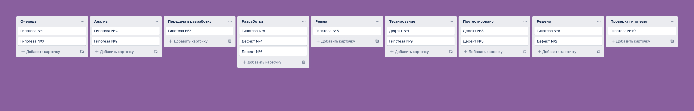

# Есть ли регламент движения задач?

Для менеджера удобно, когда все задачи размещаются на одной доске и следуют по придуманному им воркфлоу. Для всех ролей можно настроить скрытие ненужных колонок, чтобы сфокусировать их внимание. Например:
- руководство интересуют только задачи, которые требуют приемки,
- разработчиков — которые у них в работе или требуют ревью,
- аналитиков — которые требуют анализа.

Ну а менеджер выигрывает в том, что перестает перелинковывать и перекидывать задачи из разных проектов и видит все на одной доске.

# Пример устройства доски

## Очередь
Список задач пришедших из бэклога или извне. Отсортированы по приоритету реализации. Когда менеджер готов взять задачу в работу, он перетаскивает ее в колонку Анализ. 

## Анализ
Менеджер собирает требования по задаче и готовит техническое задание и дизайн. По мере необходимости, консультируется с отделом разработки. Согласовывает требования с заказчиками и всеми заинтересованными лицами. По готовности двигает задачу в колонку Передача в разработку.

## Передача в разработку
**Менеджер**
1. Приоретизирует задачу и вместе с техническим директором назначает ответственного/ых в поле **Исполнитель**.
2. Презентует задачу исполнителю/ям и убеждается, что они понимают задачу. Если в процессе находятся изъяны в тех. задании, дорабатывает его или принимает решение о сносе задачи в бэклог.
3. На усмотрение менеджера, небольшие задачи или дефекты могут не презентоваться и не оцениваться до перехода в статус Разработка.
4. Для составления дорожной карты, некоторые задачи могут иметь предварительную оценку, которая будет зафиксирована в полях Старт и Релиз.

**Разработчик**
1. Декомпозирует и оценивает задачу, результат записывает в виде комментария к задаче с упоминанием менеджера. Если в задаче произойдут изменения, то редактирует комментарий.
2. По мере готовности к новым задачам, двигает их в колонку Разработка с приоритетом к разбору сверху вниз.

## Разработка
**Менеджер**

Руководствуясь датой начала работ и оценкой разработчика, заполняет поля:
1. Старт = Дата начала работ
2. Передача в тест = дата начала + оценка всех исполнителей с учетом наложения работ + 20% от общей оценки для подстраховки.
3. Релиз = дата передачи в тест + время на тестирование по формуле: оценка всех исполнителей / 2.

**Разработчик**
1. Наделяется ответственностью, теперь судьба задачи в его руках. Он любит и лелеет ее. Вникает в смысл, думает о будущем, задает вопросы или приносит ответы.
2. Декомпозирует и оценивает задачу, если этого не произошло ранее. Сам заполняет все даты.
3. Руководствуется принципом «[Делать ≠ Сделать](https://bureau.ru/books/fff/demo/4)»
4. Руководствуется правилом «[С первого раза](./principles/fromTheFirstTime.md)». Если у задачи несколько исполнителей, то тестировании они договариваются между собой самостоятельно.
5. Руководствуется «[Правилом 50%](./principles/50.md)».
6. Комментирует все трудности и решения принятые по ходу реализации задачи.
7. Следит за колонкой и старается не набирать в нее много задач.
8. Следит за назначаемыми на него задачами, если пришел дефект по задаче, которая находится в тестировании, то его приоритет выше, чем у задач из бэклога. Важно, чтобы задача в тестировании двигалась дальше как можно скорее. Это же правило распространяется на задачи не прошедшие ревью.

**Когда разработка завершена**
1. Разработчик списывает время через кнопку Добавить затраченное время
2. Прогресс = Ревью
3. Ревью = если исполнители не указаны, то указывает исполнителя из противоположной команды.
4. Описывает в комментарии регламент деплоя, например: добавить строчки .env, запустить миграции.
5. Если разработчик знает какой-то сложный кейс, который точно надо проверить, он описывает это в задаче и доводит информацию до тестировщика.

## Ревью
Ответственный за ревью ежедневно разбирает пришедшие к нему задачи:
1. Если задача не прошла ревью, то проверяющий пишет комментарий и возвращает её в колонку «Разработка».
2. Если прошла — двигает в колонку «Тестирование».

## Тестирование
Тестировщик разбирает колонку на свое усмотрение или по договоренности с менеджером. Самостоятельно, или при поддержке разработки, заливает задачу на тестовый стенд.

Для тестирования больших задач рекомендуется составлять Тест-план. Критерий “большой” задачи тестировщик определяет самостоятельно. Тест-план составляется в формате гугл-файла по шаблону «[Как писать тест-план](../develop/docTestPlan.md)» и крепится к тестируемой задаче.

**Дефекты по задачам** заводятся по шаблону:
- Прогресс = Разработка
- Стенд = Текущий стенд тестирования
- Дефект заводится через кнопку **Связать с**.

**Дефекты регресса** заводятся по шаблону:
- Прогресс = если дефект имеет приоритет Блокирующий или Критический, то тестировщик, совместно с менеджером или тех. директором определяют исполнителя и вешают дефект в колонку Разработка. В противном случае прогресс = пусто
- Стенд = Боевой

Исправленные дефекты с тестовых стендов сразу помечаются как Решенные. В бой они поедут по номеру родительской задачи.

Дефекты с боя двигаются по всему воркфлоу, как задачи.

Тестировщик списывает время в основную задачу через кнопку Добавить затраченное время, где Тип единицы работы = Тестирование.

Когда все дефекты исправлены или согласован их пропуск, тестировщик списывает время и двигает задачу в колонку **Протестировано.**

## Протестировано
Колонка-накопитель. По согласованию, менеджер и технический диретор выливают накопившиеся задачи в бой.

## Решено
Если в релиз вошли крупные задачи, то проводим смоук-тестирование прода. Раз в неделю менеджер пишет Release Notes и сносит задачи в архив.

# Что еще
Вокруг регламента могут вырастать другие договоренности:
1. [DoR по задаче](../develop/dor.md), прежде чем она уйдет в разработку
2. Когда списывать время? Как выбрать тип работ?
3. Что войдет в [оценку разработчика](../develop/developersChecklist.md)?
4. Какие типы дефектов бывают? Как с ними работать?
5. Если задачи строятся на основе гипотез, то регламент движения задач должен учитывать еще и их проверку, например в виде отдельной колонки Проверка гипотезы (сработала/не сработала).
6. Если задача требует написание пользовательской документации, то нужен статус на передачу задачи в отдел к техническим писателям и последующий контроль исполнения.