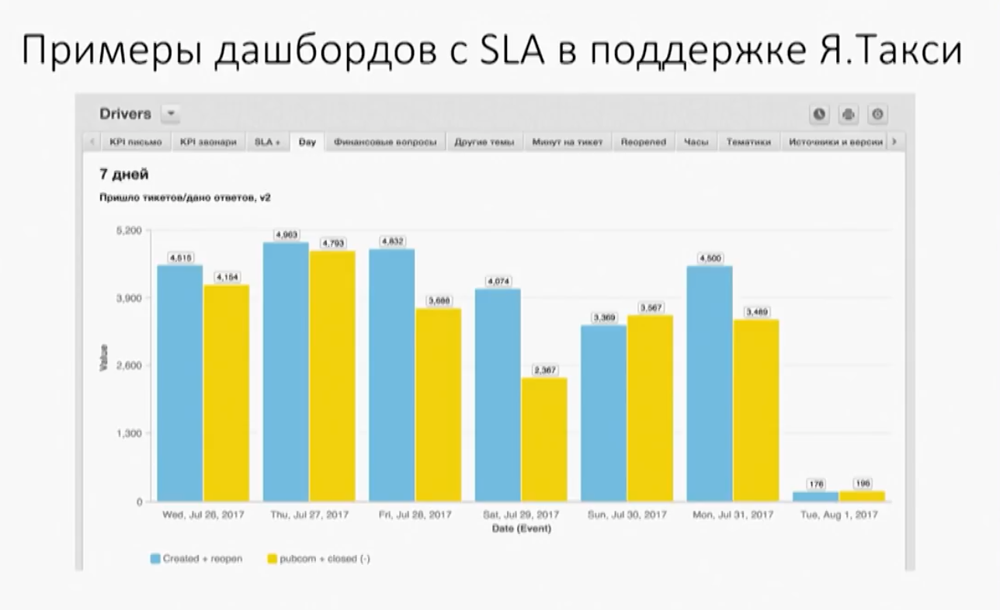
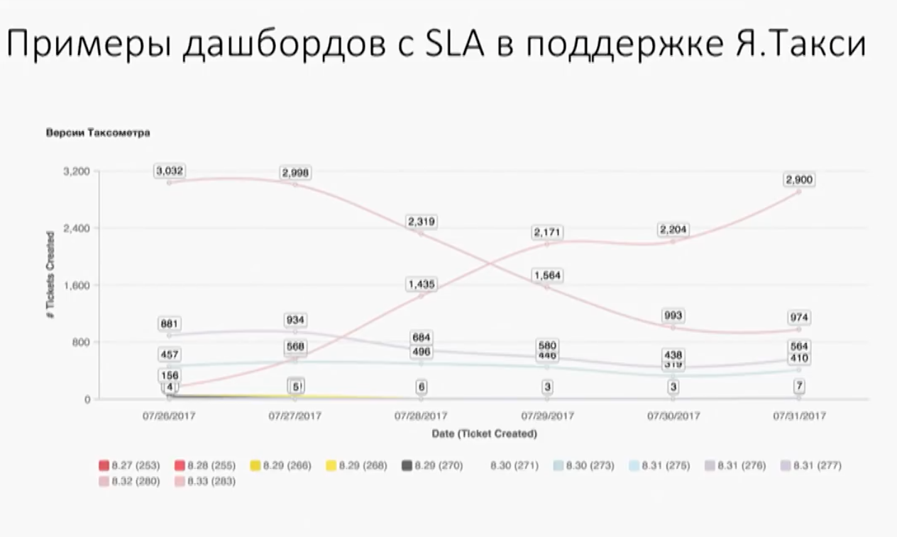
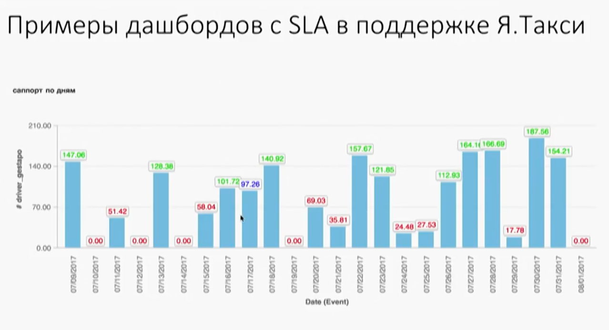

# Есть ли мониторинг и дашборды?

1. Используете ли пороговые значения? Например, шаги по 5 минут, если последние 3 промежутка превысили норму, то происходит какой-то аларм.
2. Следите ли за динамикой?
    - Резко возрасло количество тикетов
    - Увеличилось количество тикетов определенной тематики
3. Как и когда вы узнаете об этом? Как узнает команда?
4. Если что-то критическое? Кто встает по тревоге?

## Примеры из Яндекс Такси

